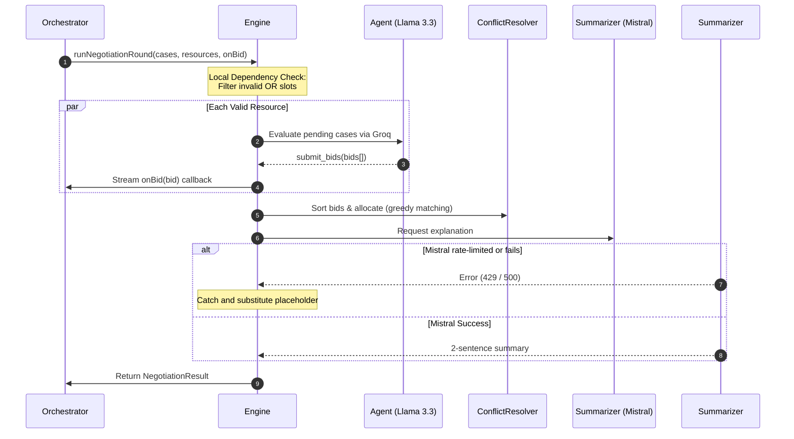

# AI Agent Architecture & Execution Guide

This document provides a comprehensive overview of the AI multi-agent architecture implemented in the Siege negotiation engine. It details the modules, models, tool schemas, and the step-by-step execution flow of the system.

---

## 1. Modules & Packages Used

The engine is built on top of native API SDKs to minimize latency and dependency bloat:

*   **`groq-sdk` (Version ^1.3.0):** Used to communicate with the Groq API. It hosts the concurrent bidding agents.
*   **`@mistralai/mistralai` (Version ^2.4.1):** Used to communicate with the Mistral API. It generates the natural-language explanations.
*   **`dotenv` (Version ^16.4.7):** Loads API keys (`GROQ_API_KEY`, `MISTRAL_API_KEY`) from the local `.env` file into process environment variables.

---

## 2. AI Models Employed

*   **`llama-3.3-70b-versatile` (Bidding Engine):** 
    *   **Role:** Powering individual resource agents.
    *   **Reason:** Extremely low latency (Groq's hardware), strong logical reasoning, and high tool-calling reliability.
*   **`mistral-large-latest` (Explanation Generator):** 
    *   **Role:** Generating admin-friendly summaries.
    *   **Reason:** High-quality language synthesis and context awareness.

---

## 3. Agent Tool Call Schema

Each resource-agent is forced to use the `submit_bids` tool. This ensures the output is returned as a structured data object instead of free-form text.

### JSON Schema Specification
```json
{
  "name": "submit_bids",
  "description": "Submit bids for cases you can handle",
  "parameters": {
    "type": "object",
    "properties": {
      "bids": {
        "type": "array",
        "items": {
          "type": "object",
          "properties": {
            "case_id": { "type": "string" },
            "resource_id": { "type": "string" },
            "bid_score": { "type": "number" },
            "reasoning": { "type": "string" },
            "conditions": { "type": "array", "items": { "type": "string" } }
          },
          "required": ["case_id", "resource_id", "bid_score", "reasoning", "conditions"]
        }
      }
    },
    "required": ["bids"]
  }
}
```

---

## 4. Step-by-Step Execution Pipeline



### Step 1: Input ingestion
The engine receives arrays of `Case` and `Resource` data representing the current emergency scenario.

### Step 2: Constraint Validation (Dependency Checks)
Before executing API requests, the engine reviews the resource list. 
*   **Operating Room rule:** An operating room slot (`or_slot`) requires at least one available clinician/surgeon (`staff` resource) in the pool.
*   Resources failing this local check are excluded from bidding to prevent invalid allocations and conserve API tokens.

### Step 3: Concurrent Agent Bidding
For each valid resource, the engine spawns a parallel execution promise:
*   Initializes a unique system prompt: *"You are an autonomous agent managing a hospital resource: [Resource ID]..."*
*   Instructs Llama 3.3 to evaluate the queue of pending cases.
*   Forces the model to format its decision using the `submit_bids` tool.

### Step 4: Real-time Streaming Callback
The moment an individual agent task resolves, the engine fires the `onBid(bid)` callback. This enables the backend to broadcast the bid to the frontend via Server-Sent Events (SSE) instantly, providing a live scrolling feed.

### Step 5: Greedy Conflict Resolution
Once all bids are gathered, the engine executes a deterministic greedy matching algorithm:
1.  Bids are sorted in descending order of `bid_score` (highest priority first).
2.  The engine iterates through the sorted list, matching case IDs to resource IDs.
3.  If a resource or case has already been assigned in this round, the bid is skipped.

### Step 6: Summary Generation (Decoupled & Resilient)
*   The final allocations and raw bids are passed to Mistral Large to write a 2-sentence explanation.
*   **Decoupled Try-Catch:** If the Mistral service fails or is rate-limited (HTTP 429), it is caught locally. The engine substitutes a placeholder description, keeping the calculated allocations intact rather than failing the round.

### Step 7: Fallback Matrix
If a fatal error (e.g. total API outage) occurs during the bidding phase, the engine defaults to `getFallbackData` to return a safe fallback allocation matrix (e.g. allocating the first case to the first resource).

---

## 5. Why this is Classified as an AI Agent Architecture

This project is classified as a **Multi-Agent System** rather than a standard LLM script because:

1.  **Decentralized Autonomy:** We do not ask a single LLM call to solve the entire matching problem. Instead, each resource functions as an isolated agent that only knows its own state and acts independently.
2.  **State & Context Personalization:** The system context is parameterized per resource (system prompt contains its specific type, department, and ID), giving each worker its own persona and objective.
3.  **Structured Tool Use:** The LLM's outputs are strictly converted into physical actions (tool call parameters) restricted by environment constraints (dependency checks).
4.  **Market Competition:** The conflict resolver acts as an environmental coordinator to handle competing bids from different resource agents.
