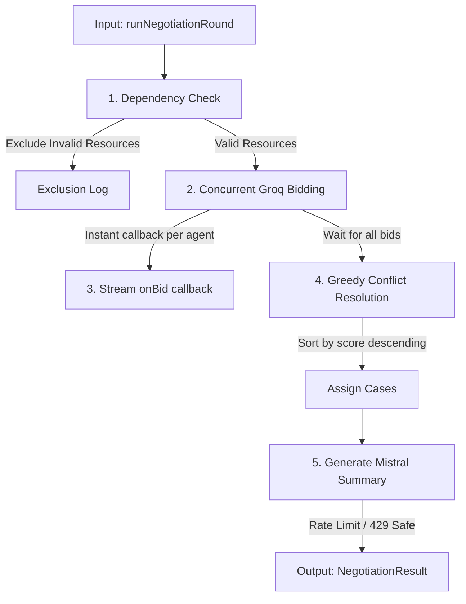

# Integration Guide: Person B AI Negotiation Engine

This guide provides step-by-step instructions for **Person A (Database/SSE)** and **Person C (Orchestrator)** to integrate the Person B AI Negotiation Engine into the unified Siege platform.

---

## 1. How the Engine Works Internally

The negotiation round operates as a pipeline of five main steps to resolve resource constraints in real time:



### 1.1 Dependency Validation
Before making any external API calls, the engine runs local constraint checks on the resource pool:
* An operating room slot (`or_slot`) requires at least one available clinician/surgeon (`staff` resource) in the pool.
* If a resource's dependencies are unmet, it is excluded from bidding immediately. This saves API tokens and prevents invalid allocations.

### 1.2 Agentic Bidding (Llama 3.3 via Groq)
For each valid resource, the engine spins up concurrent asynchronous tasks:
* The resource acts as an autonomous agent using Llama 3.3.
* It evaluates the array of pending `Case` objects.
* It selects the case it is best suited to handle and returns a structured bid including `bid_score` (priority, severity fit), `reasoning` (why it's matching), and any `conditions` (pre-requisites).

### 1.3 Real-Time Streaming Callback
The moment an individual resource agent's HTTP request resolves, the engine fires the `onBid(bid)` callback instantly. This enables Person C to broadcast `bid_submitted` events over Server-Sent Events (SSE) immediately, showing users a live-scrolling bidding dashboard instead of waiting for the full round to complete.

### 1.4 Greedy Conflict Resolution
Once all bids are collected, the engine runs a deterministic greedy match:
* Bids are sorted in descending order of `bid_score` (highest priority first).
* The algorithm iterates through the list, assigning resources to cases.
* If a resource or case has already been allocated in this round, the bid is skipped.

### 1.5 Explanation Summary & Fallback
* The final allocation array and raw bids are sent to **Mistral Large** to generate a fast, 2-sentence explanation of the allocations.
* **Rate-Limit Resilience:** The Mistral call is isolated. If it fails or is rate-limited (HTTP 429), it is caught gracefully, substituting a generic text summary ("*Allocations processed successfully. Summary explanation is temporarily unavailable.*") without failing the entire negotiation round.
* **Global Fallback:** If a fatal network failure occurs during the bidding phase, the engine automatically catches the error and executes `getFallbackData` to return a safe fallback allocation matrix.

---

## 2. Engine API Contract

The engine is implemented as a **pure function** in `src/engine.ts`. It does not make any database queries or state updates directly. It accepts inputs as arrays and returns a structured promise.

### Import Path
```typescript
import { runNegotiationRound } from './person_b_engine/dist/engine.js';
import { Case, Resource, Bid, Allocation, NegotiationResult } from './person_b_engine/dist/types.js';
```

### Signature
```typescript
export async function runNegotiationRound(
  cases: Case[],
  resources: Resource[],
  onBid?: (bid: Bid) => void,
  roundId?: string
): Promise<NegotiationResult>;
```

---

## 3. Instructions for Person C: Orchestrator

Your job is to schedule the negotiation rounds, debounce incoming events (using Upstash Redis), fetch current state from the database, run the engine, and trigger updates.

### 2.1 Implementing the Flow
When you trigger a negotiation round:
1. **Fetch current state:** Call Person A's `loadState(emergencyId)` to retrieve the current pending cases and available resources.
2. **Execute negotiation:** Invoke `runNegotiationRound` passing the cases, resources, a streaming callback, and the current `roundId`.
3. **Handle real-time streaming:** In the `onBid` callback, instantly call Person A's `broadcast` function to stream bids to the frontend via SSE.
4. **Persist the results:** Once the engine returns, call Person A's `saveBids` and `saveResult` to persist the outputs.

### 2.2 Orchestration Reference Code
```typescript
import { runNegotiationRound } from './person_b_engine/dist/engine.js';
import { loadState, saveBids, saveResult, broadcast } from './db_sse.js';

export async function triggerRound(emergencyId: string, roundId: string): Promise<void> {
  // 1. Fetch current database state
  const { cases, resources } = await loadState(emergencyId);

  // 2. Run the AI engine with a streaming callback
  const result = await runNegotiationRound(
    cases,
    resources,
    (bid) => {
      // Stream each individual bid to the frontend the instant it resolves
      broadcast(emergencyId, 'bid_submitted', {
        ...bid,
        round_id: roundId
      });
    },
    roundId
  );

  // 3. Persist bids and final allocations
  await saveBids(roundId, result.bids);
  await saveResult(roundId, result.allocations, result.explanation);

  // 4. Signal round completion to the frontend
  broadcast(emergencyId, 'round_completed', {
    roundId,
    allocations: result.allocations,
    explanation: result.explanation
  });
}
```

---

## 4. Instructions for Person A: Database & SSE

Your job is to provide the database schema and expose functions that allow the orchestrator to load state, persist bids/results, and stream events over Server-Sent Events.

### 3.1 Exposing Core Database Functions
Expose the following async functions matching these signatures:

```typescript
import { Case, Resource, Bid, Allocation } from './person_b_engine/dist/types.js';

// Load all cases and resources for a specific emergency
export async function loadState(emergencyId: string): Promise<{ cases: Case[]; resources: Resource[] }>;

// Save all bids generated during the round
export async function saveBids(roundId: string, bids: Bid[]): Promise<void>;

// Save final allocations and the Mistral explanation text
export async function saveResult(roundId: string, allocations: Allocation[], explanation: string): Promise<void>;

// Broadcast a message to connected clients over SSE
export function broadcast(emergencyId: string, event: string, payload: any): void;
```

### 3.2 Database Table Schema Requirements
Ensure your Supabase/PostgreSQL schema holds fields corresponding to the TypeScript models:

#### Table `bids`
Used in `saveBids(roundId, bids)`. Needs to store:
* `round_id` (UUID/text)
* `case_id` (UUID/text)
* `resource_id` (UUID/text)
* `bid_score` (decimal/numeric)
* `reasoning` (text)
* `conditions` (text array `text[]`)

#### Table `allocations`
Used in `saveResult(roundId, allocations, explanation)`. Needs to store:
* `round_id` (UUID/text)
* `case_id` (UUID/text)
* `resource_id` (UUID/text)

---

## 5. Verification & Testing

Verify your integration in isolation by running the local validation script inside the `person_b_engine` folder:
```bash
cd person_b_engine
npm run build
npm run test
```
This guarantees the engine executes properly under Groq/Mistral rate-limiting conditions and returns correctly shaped objects.
