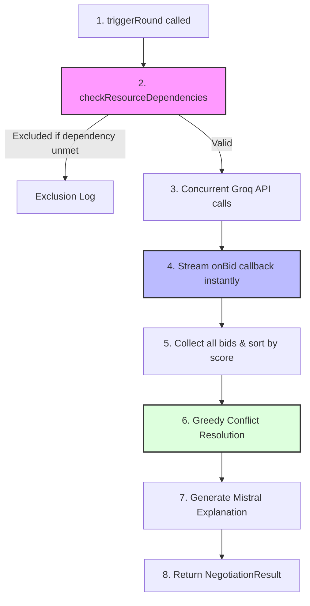

# Person B Engine: Execution & Integration Guide

This guide describes how the Autonomous Negotiation Engine executes step-by-step and explains how Person A (Database & SSE) and Person C (Orchestrator) should connect it to the unified platform.

---

## 1. Step-by-Step Execution Flow

When a negotiation round is executed via `runNegotiationRound`, the following steps occur in order:



### 1.1 Initialization & Input
The orchestrator calls `runNegotiationRound(cases, resources, onBid, roundId)`.

### 1.2 Dependency Validation
Before making any API calls, the engine checks real-world constraints:
- Operating room resources (`or_slot`) require at least one available `staff` (surgeon/clinician) resource in the pool.
- If dependencies are missing, the resource is excluded immediately to save LLM tokens and prevent invalid allocations.

### 1.3 Agentic Bidding (Concurrent Llama 3.3)
For each resource that passed dependency checks, a concurrent task is created. Each resource acts as an autonomous agent using Llama 3.3 on Groq:
- The agent evaluates the queue of pending cases.
- It determines which patient case is the best fit.
- It submits a structured bid detailing `bid_score` (priority), `reasoning` (why it's matching), and `conditions` (pre-requisites).

### 1.4 Real-time Streaming Callback
The moment an individual resource-agent's API call resolves:
- The engine triggers the `onBid(bid)` callback immediately.
- This allows Person C to broadcast `bid_submitted` over Server-Sent Events (SSE) immediately, creating a live scrolling dashboard rather than a static page reload at the end.

### 1.5 Greedy Conflict Resolution
Once all bids are returned, conflict resolution runs deterministically:
- Bids are sorted in descending order of `bid_score` (highest priority first).
- The algorithm processes the sorted list, allocating resources to cases on a first-come, first-served basis. If a resource or case is already allocated, it is skipped.

### 1.6 Summary Generation & Fallback Protection
- The final allocations and raw bids are passed to **Mistral Large** to generate a fast, 2-sentence natural-language explanation of the results.
- If an API call fails or rate-limits (HTTP 429), the engine automatically redirects execution through a safe fallback routine (`getFallbackData`) to return a safe allocation matrix and maintain system availability.

---

## 2. API Contract & Shared Types

Ensure these interfaces are identical across the codebase in `src/types.ts`:

```typescript
export interface Case {
  id: string;
  emergency_id?: string;
  severity: number;
  status: string; // 'pending' | 'allocated' | 'discharged'
  types: string[];
}

export interface Resource {
  id: string;
  type: string; // 'or_slot' | 'icu_bed' | 'staff' | 'equipment' | 'er_bay'
  status: string; // 'available' | 'occupied' | 'reserved' | 'offline'
  department: string;
}

export interface Bid {
  round_id?: string;
  case_id: string;
  resource_id: string;
  bid_score: number;
  reasoning: string;
  conditions: string[];
}

export interface Allocation {
  case_id: string;
  resource_id: string;
}

export interface NegotiationResult {
  bids: Bid[];
  allocations: Allocation[];
  explanation: string;
}
```

---

## 3. Integration Details

### 3.1 Person A: Database & SSE Broadcasting
Person A must supply four core functions to the orchestrator:
- `loadState(emergencyId: string): Promise<{ cases: Case[], resources: Resource[] }>`
- `saveBids(roundId: string, bids: Bid[]): Promise<void>`
- `saveResult(roundId: string, allocations: Allocation[], explanation: string): Promise<void>`
- `broadcast(emergencyId: string, event: string, payload: any): void`

### 3.2 Person C: Orchestration & Timing
Person C imports your function and ties the data layer to the streaming layer inside the event scheduler:

```typescript
import { runNegotiationRound } from './engine.js';
import { loadState, saveBids, saveResult, broadcast } from './db_sse.js';

export async function triggerRound(emergencyId: string, roundId: string): Promise<void> {
  // 1. Fetch data from Supabase
  const { cases, resources } = await loadState(emergencyId);

  // 2. Run engine and pass live callback to SSE
  const { bids, allocations, explanation } = await runNegotiationRound(
    cases,
    resources,
    (bid) => {
      // Stream each bid live as it arrives
      broadcast(emergencyId, 'bid_submitted', { ...bid, round_id: roundId });
    },
    roundId
  );

  // 3. Persist records
  await saveBids(roundId, bids);
  await saveResult(roundId, allocations, explanation);

  // 4. Signal round completion
  broadcast(emergencyId, 'round_completed', { roundId, allocations });
}
```

---

## 4. How to Verify
To verify everything runs in isolation, build and execute the local test runner:
```bash
npm run build
npm run test
```
This validates all 8 Person B specification requirements, including streaming timing, bid shapes, dependency checks, and API rate-limit resilience.
